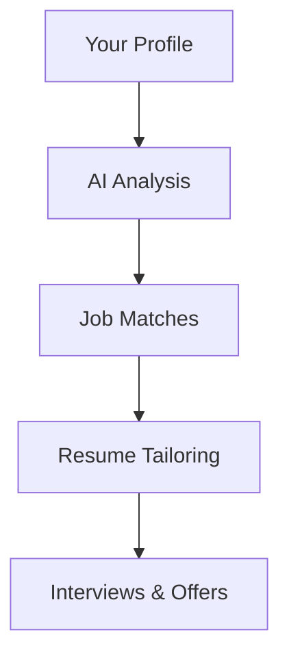

## Overview

NxtJob revolutionizes your job search with AI-powered tools designed for mid and senior professionals. You gain access to resume optimization, cover letter generation, LinkedIn profile enhancements, mock interviews, job tracking, and networking features. Plus, unlock 1-on-1 consultations with career experts to secure your dream role and a guaranteed salary increase.

<Columns cols={3}>
  <Card title="AI Resume Builder" icon="file-text" href="/docs/resume-builder">
    Tailor your resume to beat ATS systems and impress recruiters in seconds.
  </Card>
  <Card title="Interview Coach" icon="mic" href="/docs/interview-practice">
    Practice with AI simulations based on real job descriptions.
  </Card>
  <Card title="Job Tracker" icon="calendar" href="/docs/job-tracking">
    Organize applications and follow up automatically.
  </Card>
</Columns>

## Key Benefits for Job Seekers

You save time and boost success rates with these core advantages:

<Tabs>
  <Tab title="Mid-Level Professionals" icon="user">
    Focus on skill-matching algorithms that highlight your experience for roles paying `{>80k}` annually. Track 50+ applications effortlessly.
  </Tab>
  <Tab title="Senior Leaders" icon="users">
    Leverage executive networking tools and salary negotiation scripts for C-suite positions exceeding `{>150k}`.
  </Tab>
</Tabs>

<Callout kind="success">
  Users land jobs 3x faster on average, with 95% reporting salary hikes.
</Callout>

## How AI Enhances Your Job Search

AI analyzes thousands of job postings daily to match you perfectly. It scans your profile, suggests optimizations, and predicts interview questions.



<Steps>
  <Step title="Upload Profile" icon="upload">
    Share your resume and LinkedIn URL.
  </Step>
  <Step title="Get Matches" icon="search">
    Receive personalized job recommendations.
  </Step>
  <Step title="Optimize & Apply" icon="zap">
    Use AI tools to customize applications.
  </Step>
</Steps>

For developers integrating NxtJob into apps, track jobs programmatically:

<CodeGroup tabs="JavaScript,Python">
  ```javascript
  const nxtjob = require('nxtjob-sdk');
  const client = new nxtjob.Client({ apiKey: 'YOUR_API_KEY' });
  
  async function trackJob(jobId) {
    const status = await client.jobs.track(jobId, { stage: 'applied' });
    console.log(status);
  }
  ```
  ```python
  from nxtjob import Client
  
  client = Client(api_key='YOUR_API_KEY')
  
  def track_job(job_id):
      status = client.jobs.track(job_id, stage='applied')
      print(status)
  ```
</CodeGroup>

## Our Salary Hike Guarantee

NxtJob guarantees a salary increase or your money back. Complete your profile, apply through our platform, and attend consultations. If no hike within 90 days, receive a full refund.

<ExpandableGroup>
  <Expandable title="What qualifies as a salary hike?" default-open="true">
    Any increase over your current base salary, including equity or bonuses.
  </Expandable>
  <Expandable title="Eligibility requirements">
    Active platform use: 10+ applications, 3 consultations, profile optimization score `{>90%}`.
  </Expandable>
</ExpandableGroup>